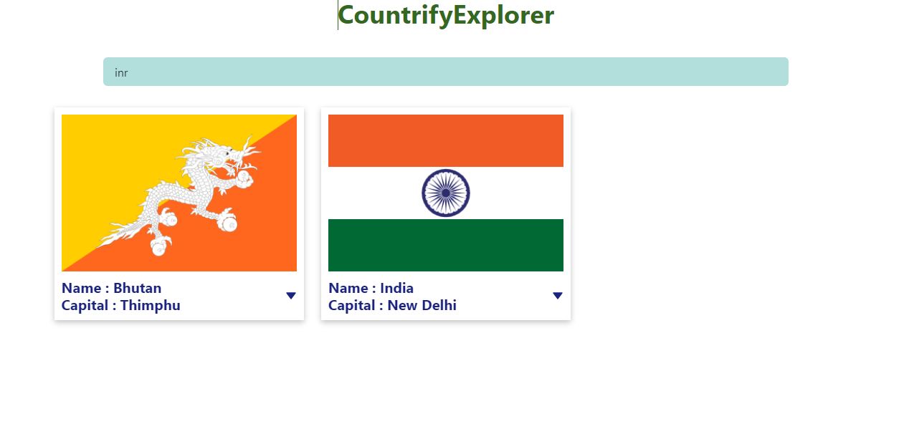

# mettasocial_coding_assignment

### CountryExplorer
### Introduction
This webpage allows users to identify countries associated with a particular currency. Users can input a currency , and the app will fetch and display a list of countries associated with that currency.

